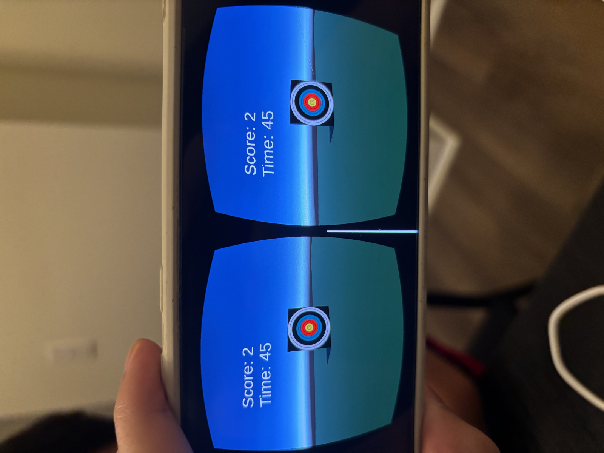

# Target Practice

COMP 590 Assignment 1. A Google Cardboard game built in Unity 6.5
(6000.5.9f1) and deployed to Android.

Chris Kim, chriskk@unc.edu

## The game

You stand in one spot wearing a Cardboard headset. Pressing the Cardboard button
shoots a ball wherever you're looking, so aiming means turning your head. Hit the
target and you get a point, and the target immediately jumps somewhere else. You
have 60 seconds to score as much as you can, then the round ends and you can tap
to play again.

Two things keep it from being trivial: the launch force is randomized every shot,
so you can't memorize one head position that works, and gravity pulls the ball
down on the way out, so you have to aim high.

## Why it's a game

Schell lands on "a game is a problem-solving activity, approached with a playful
attitude," and I think this fits.

The problem is "how many targets can I hit in 60 seconds," which is close to his
own example of "find a way to get more points." It stays a problem instead of
something you solve once because the random force and the moving target mean the
answer changes every shot. That's what his Lens of Problem Solving is after when
it asks whether a game keeps generating new problems.

It also covers the ten qualities he pulls out of the definitions he goes through.
Nothing happens until the player presses the button and the world reacts when
they do (Q1, Q6). The goal is a score (Q2), and the rules are enforced by code:
one ball per press, points only for hits, round over when the clock says so (Q4).
The clock is the piece I added specifically for this. Without it you could shoot
forever with no way to win or lose, which makes it a toy rather than a game by
his definition. The timer gives it the outcome that starts even and resolves into
a result (Q5). The conflict and challenge are the clock and the physics (Q3, Q7).

Points mean nothing outside the round, which is his idea of endogenous value
(Q8). Through that lens the score works here like rings in Sonic 2 rather than
yarn balls in Bubsy, because it's the only measure of success and the timer makes
each point cost something. VR makes engagement easy since the game is your whole
field of view (Q9), and it's a closed system with a fixed space, fixed clock, and
a score that resets (Q10).

He defines fun as pleasure with surprises, and the surprises are the random force
and not knowing where the target lands next.

The weak spot is that it's one mechanic with no progression and no opponent. I
don't think that rules it out, since he brings up Tetris as not really being a
contest of powers either and still counts it.

## Sources

* The assignment handout, which is where the base shooting scene and `target.png` came from
* [Google Cardboard XR Plugin](https://github.com/googlevr/cardboard-xr-plugin) and the [Unity quickstart](https://developers.google.com/cardboard/develop/unity/quickstart)
* Jesse Schell, *The Art of Game Design*, Chapter 4
* [Tennis ball asset by gaurav62](https://gaurav62.itch.io/tennisall-asset) for the projectile texture

Geometry is all Unity primitives, no third party models. The build I deployed is
`Builds/CardboardBuild3.apk`.
